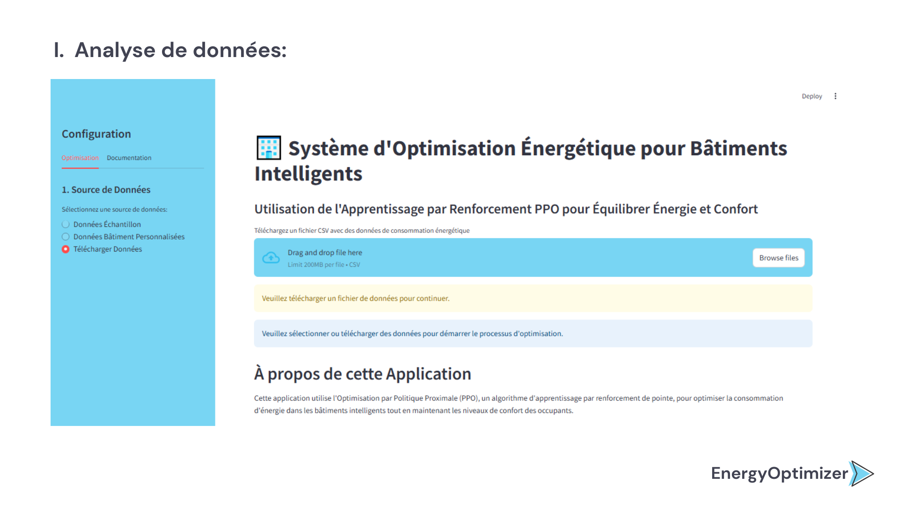
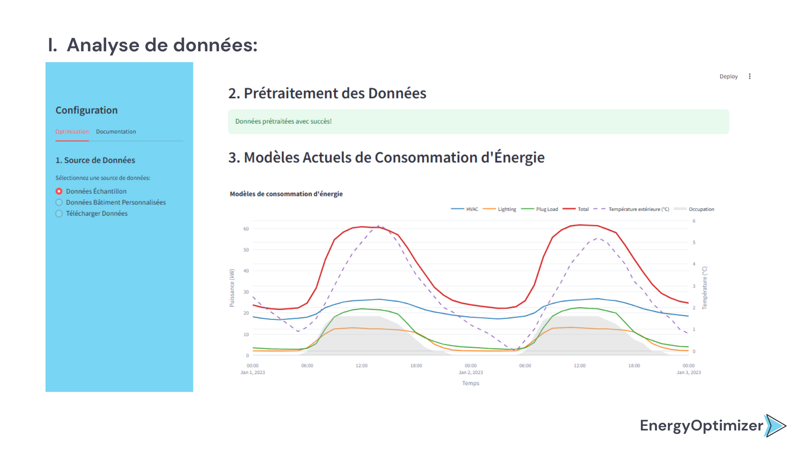
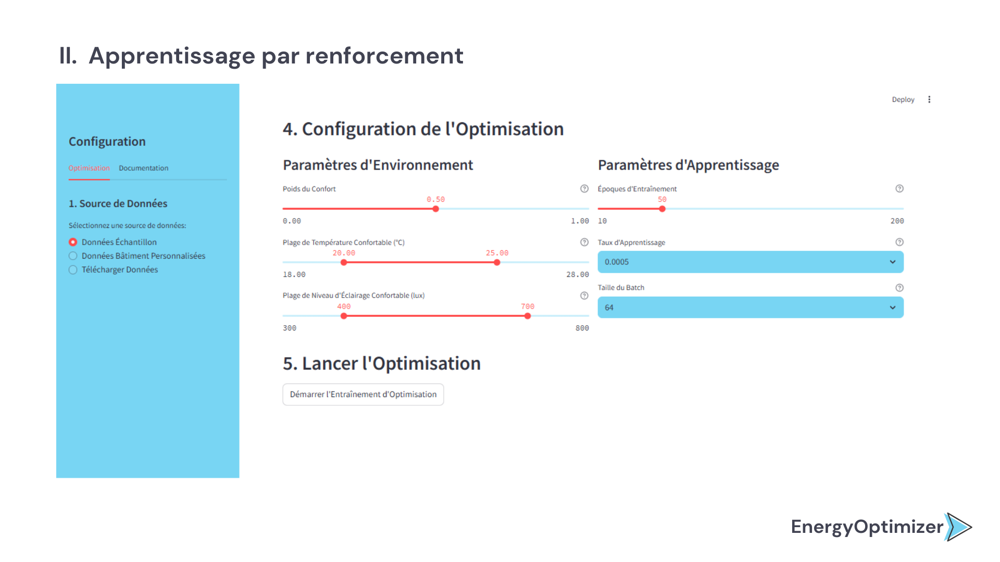
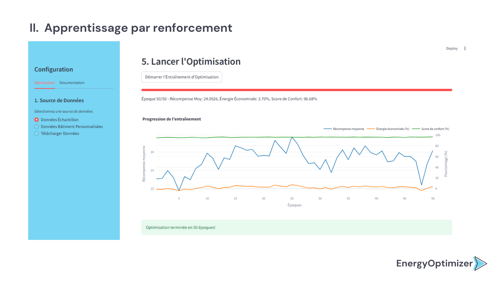
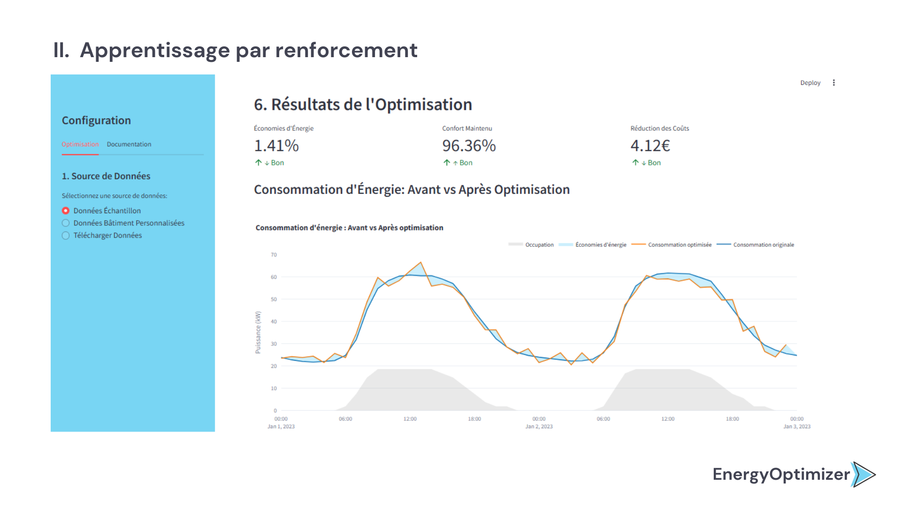
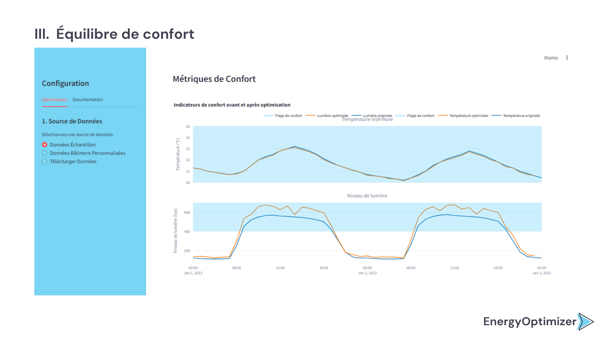
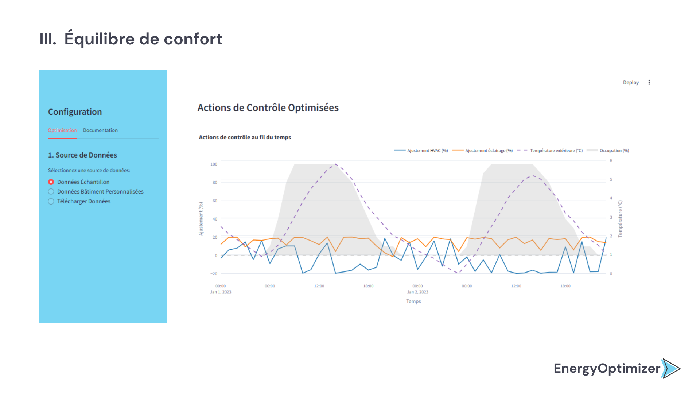
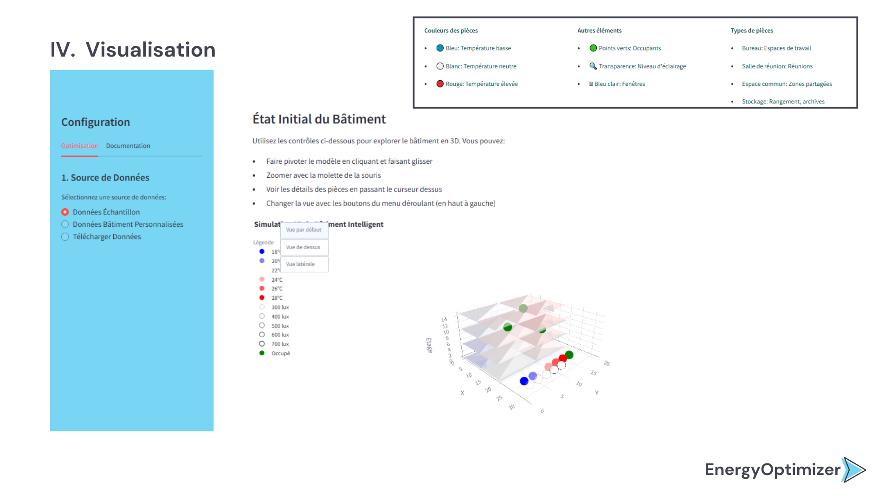
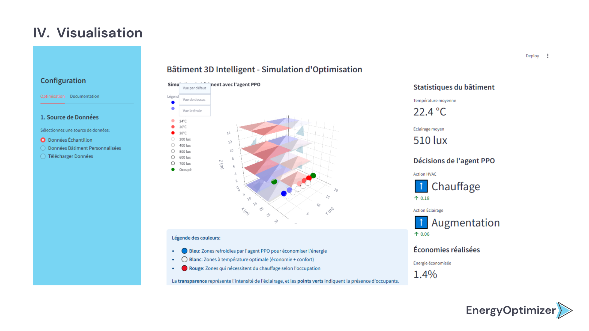
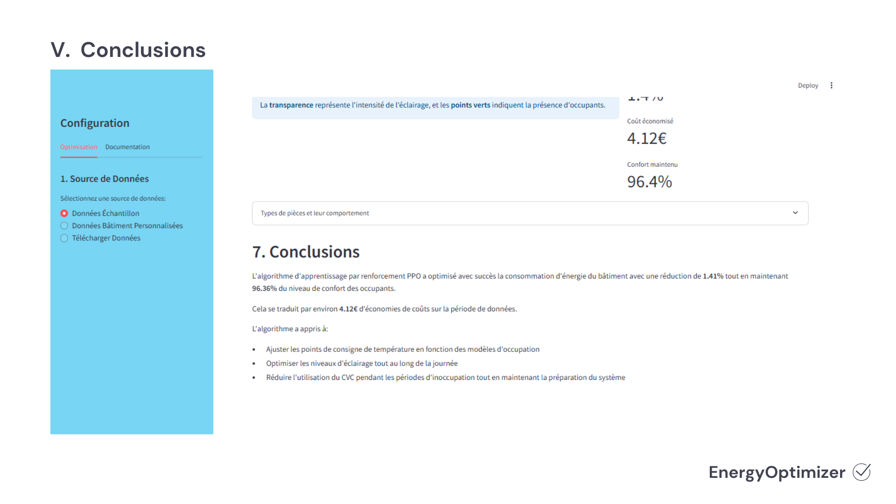

## 1. Description

EnergyOptimizer est un système avancé d'optimisation énergétique pour bâtiments intelligents qui utilise l'algorithme d'apprentissage par renforcement PPO (Proximal Policy Optimization). Cette solution permet de réduire la consommation d'énergie tout en maintenant un niveau optimal de confort pour les occupants.

Le système analyse en temps réel les données du bâtiment (température, éclairage, occupation) et prend des décisions intelligentes pour ajuster les systèmes HVAC (chauffage, ventilation, climatisation) et d'éclairage de manière optimale.

## 2. Fonctionnalités

- **Optimisation énergétique avancée** utilisant l'algorithme PPO
- **Équilibre automatique** entre économie d'énergie et confort des occupants
- **Visualisation 3D interactive** du bâtiment et des résultats d'optimisation
- **Analyse de données** de consommation énergétique historiques
- **Interface utilisateur intuitive** en français avec visualisations détaillées
- **Simulation réaliste** des effets des décisions d'optimisation

## 3. Structure du projet
- **app.py**: Application Streamlit principale et interface utilisateur
- **energy_env.py**: Environnement Gym pour la simulation du bâtiment intelligent
- **ppo_agent.py**: Implémentation de l'agent d'apprentissage par renforcement PPO
- **building_3d_vis.py**: Visualisation 3D du bâtiment avec Plotly
- **utils.py**: Fonctions utilitaires pour le traitement des données
- **training.py**: Fonctions d'entraînement de l'agent
- **visualization.py**: Fonctions de visualisation des résultats
  
Voir le fichier : [Document explicatif](Document/DocumentExplicatif.pdf)


## 4. Installation

1. Clonez ce dépôt:
```bash
git clone https://github.com/soukayna-thr/EnergyOptimizer_PPO
cd EnergyOptimizer_PPO
```

2. Installez les dépendances:
```bash
pip install -r requirements.txt
```

3. Lancez l'application:
```bash
streamlit run app.py
```

## 5. Configuration

### Personnalisation des paramètres

Vous pouvez ajuster les paramètres suivants via l'interface utilisateur:

- **Équilibre Confort/Économie**: Ajustez le poids accordé au confort versus aux économies d'énergie
- **Paramètres d'apprentissage**: Taux d'apprentissage, taille de lot, nombre d'époques
- **Configuration du bâtiment**: Nombre d'étages, pièces par étage, types de pièces


## 6. Fondements théoriques

### Apprentissage par renforcement

L'algorithme PPO utilisé dans ce projet est une méthode d'apprentissage par renforcement de pointe qui offre:
- Une stabilité d'apprentissage supérieure
- Une efficacité d'échantillonnage améliorée
- Une performance robuste dans des environnements complexes

### Optimisation énergétique des bâtiments

Le système modélise:
- Les dynamiques thermiques du bâtiment
- Les modèles d'occupation
- Les courbes de consommation énergétique
- Les préférences de confort des occupants

## 7. Exemples de résultats

Dans nos tests typiques, le système a démontré:
- Réduction de consommation énergétique: 15-30%
- Maintien du confort des occupants: >85%
- Economie des couts environ 5-11$

## 8. Captures d'écran

L'application comprend:
- Visualisation 3D du bâtiment intelligent
- Graphiques d'analyse de consommation énergétique
- Interface de configuration des paramètres d'optimisation

<p float="left">
  
  
</p>

<p float="left">
  
  
</p>
<p float="left">
  
</p>
<p float="left">
  
  
  
  
  
</p>
<p float="left">
  
</p>


## 9. Contribuer

Les contributions sont les bienvenues! Pour contribuer:

1. Forkez le projet
2. Créez une branche pour votre fonctionnalité
3. Committez vos changements
4. Poussez vers la branche
5. Ouvrez une Pull Request

## 📄 Licence

Ce projet est sous licence MIT - voir le fichier [LICENSE](LICENSE) pour plus de détails.


